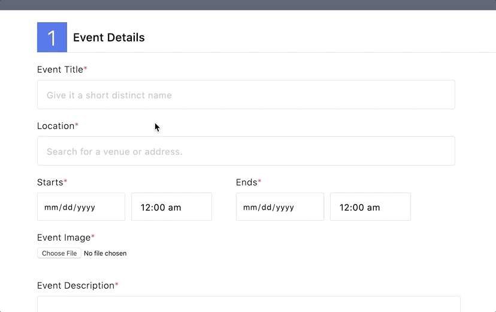

# Eventlite

[Eventlite Live Link](https://eventlite-fsp.herokuapp.com)

Eventlite, an Eventbrite clone, is a full stack event discovery and planning web application. The app allows users to perform all CRUD actions including finding, creating, and registering for events that can be viewed and bookmarked by other users. It was developed using Ruby on Rails backend, PostgreSQL database, and React/Redux frontend.


## Technologies Used
- Front-end:
  - React
  - Redux
- Back-end:
  - Ruby on Rails
  - PostgreSQL
- Cloud:
  - AWS S3
  - Heroku

## Key Features
- User authentication
- Create/Read/Update/Delete events
- Event Registrations and Bookmarks
- Uploading images via AWS
- Address autocomplete via Google Maps Places API

## Landing Page

The landing page features the Event Index with tabs to selectively display events by their respective category/ticket type.


```javascript
//Match current path with desired criteria such as ticket type or category
//to filter and display events.
let filteredEvents;
switch (indexPath) {
    case 'free':
        filteredEvents = events.filter(e => e.ticket_type === 'Free')
        break;
    case 'music':
        filteredEvents = events.filter(e => e.category === 'Music')
        break;
    case 'food-drink':
        filteredEvents = events.filter(e => e.category === 'Food & Drink')
        break;
    case 'sports-fitness':
        filteredEvents = events.filter(e => e.category === 'Sports & Fitness')
        break;
    default:
        filteredEvents = events
        break;
}

filteredEvents = filteredEvents.map((event, i) => (
    <EventIndexItem key={i} event={event} />
))

return(
    <div className='event-index'>
        { filteredEvents }
    </div>
)
```

## Events

Users can look up events by event title using the search bar.


Users can create new events using a form, with the option to upload an event photo. Photos are saved to AWS S3, and if no image is uploaded, a default is set. Google Places Autocomplete is implemented for location input.



Each Event Show page contains functions to Register for, or Bookmark an event.


Registered and bookmarked events appear in the user's profile page.


### Future Features
- Search capabilities to find and look up events by title
- Implement Google Maps API to show a map with location marker for each event
- Use Google Maps Places Autocomplete API to provide address suggestions upon user input (during event creation)
